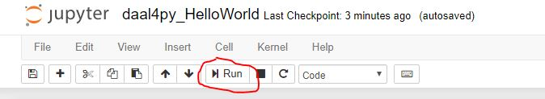

# daal4py Distributed LinearRegression
This sample code shows how to train and predict with a distributed linear regression model using the python API package daal4py for oneAPI Data Analytics Library. It assumes you have a working version of MPI library installed. 

## Key implementation details 
This distributed linear regression sample code is implemented for CPU using the Python language. The example assumes you have daal4py and scikit-learn installed inside a conda environment, similar to what is delivered with the installation of the Intel(R) Distribution for Python as part of the [oneAPI AI Analytics Toolkit](https://software.intel.com/en-us/oneapi/ai-kit). 
 

## Additional Requirements
You will need a working MPI library. We recommend to use Intel(R) MPI, which is included in the [oneAPI HPC Toolkit](https://software.intel.com/en-us/oneapi/hpc-kit).
  

## How to Build and Run 

oneAPI Data Analytics Library is ready for use once you finish the Intel AI Analytics Toolkit installation, and have run the post installation script.

You can refer to the oneAPI [main page](https://software.intel.com/en-us/oneapi) for toolkit installation, and the Toolkit [Getting Started Guide for Linux](https://software.intel.com/en-us/get-started-with-intel-oneapi-linux-get-started-with-the-intel-ai-analytics-toolkit) for post-installation steps and scripts.

## Activate conda environment

Please follow the Getting Started Guide steps (above) to set up your oneAPI environment with the setvars.sh script. Then navigate in linux shell to your oneapi installation path, typically `~/intel/inteloneapi`. Intel Python environment will be activte by default. However, if you activated another environment, you can return with the following command:

#### Linux
```
source activate root
```

## Install Jupyter Notebook
```
conda install jupyter nb_conda_kernels
```

#### _View in Jupyter Notebook_

_Note: This distributed execution cannot be launched from the jupyter notebook version, but you can still view inside the notebook to follow the included write-up and description._

Launch Jupyter Notebook in the directory housing the code example

```
jupyter notebook
```

Open .pynb file and run cells in Jupyter Notebook using the "Run" button (see image)




#### _Run as Python File_

When using daal4py for distributed memory systems, the command needed to execute the program should be executed in a bash shell. To execute this example, run the following command, where the number **4** is chosen as an example and means that it will run on **4 processes**:

Run the Program

`mpirun -n 4 python ./daal4py_Distributed_LinearRegression.py`

The output of the script will be saved in the included models and results directories. 

_Note: This code samples focuses on how to use daal4py to do distributed ML computations on chunks of data. The `mpirun` command above will only run on single local node. In order to launch on a cluster, you will need to create a host file on the master node among other steps. The **TensorFlow_Multinode_Training_with_Horovod** code sample explains this process well._

## License  
This code sample is licensed under MIT license