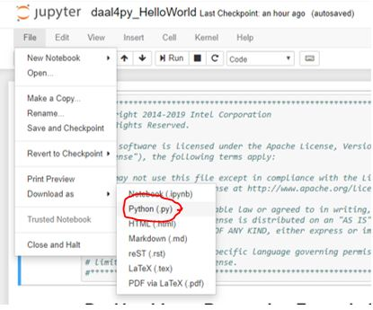

# daal4py HelloWorld
This Hello World sample code show how to do batch linear regression using the python API package daal4py for oneAPI Data Analytics Library. 

## Key implementation details 
This Hello World sample code is implemented for CPU using the Python language. The example assumes you have daal4py and scikit-learn installed inside a conda environment, similar to what is delivered with the installation of the Intel(R) Distribution for Python as part of the [oneAPI AI Analytics Toolkit](https://software.intel.com/en-us/oneapi/ai-kit). 


## How to Build and Run 

oneAPI Data Analytics Library is ready for use once you finish the Intel AI Analytics Toolkit installation, and have run the post installation script.

You can refer to the oneAPI [main page](https://software.intel.com/en-us/oneapi) for toolkit installation, and the Toolkit [Getting Started Guide for Linux](https://software.intel.com/en-us/get-started-with-intel-oneapi-linux-get-started-with-the-intel-ai-analytics-toolkit) for post-installation steps and scripts.

## Activate conda environment

Please follow the Getting Started Guide steps (above) to set up your oneAPI environment with the setvars.sh script. Then navigate in linux shell to your oneapi installation path, typically `~/intel/inteloneapi`. Intel Python environment will be activte by default. However, if you activated another environment, you can return with the following command:

#### Linux
```
source activate root
```

### Install Jupyter Notebook_

Launch Jupyter Notebook in the directory housing the code example

```
conda install jupyter nb_conda_kernels
```

#### _View in Jupyter Notebook_

_Note: This distributed execution cannot be launched from the jupyter notebook version, but you can still view inside the notebook to follow the included write-up and description._

Launch Jupyter Notebook in the directory housing the code example

```
jupyter notebook
```

Open .pynb file and run cells in Jupyter Notebook using the "Run" button (see image)


#### _Run as Python File_

Open notebook in Jupyter and download as python file



Run the Program

`python daal4py_HelloWorld.py`

The output of the script will be saved in the included models and results directories. 

## License  
This code sample is licensed under MIT license